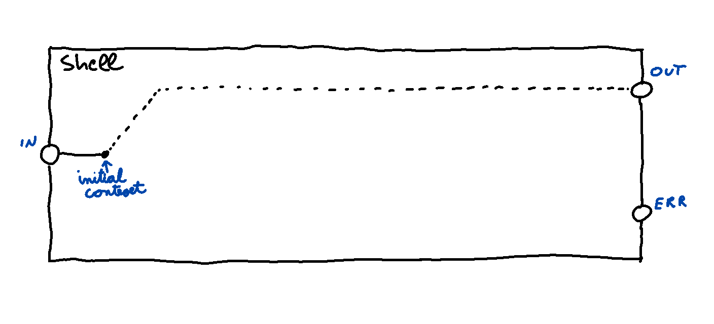

scriptscript - "Shell Scripts" using Javascript
===============================================

__THIS DOCUMENT IS WORK IN PROGRESS__

Typically, shell scripts are your weapon of choice whenever you need to
do simple automation tasks like orchestrating a couple of other programms
for a particular task.  

scriptscript is an attempt to provide a similar environment on top of NodeJS.

Features 
--------

- Expressive: scriptscript puts the 'script' back into 'Javascript': think "The
  Good Parts" plus pipes plus filters equals awesome. 

- Modular: The DSL core is tiny. It includes basic stuff like language primitives for IO-redirection.
  You can use it together with a set of basic built-in commands (TODO) or roll your own.

- Easy to extend: To create your own commands you provide a functions that creates a filter. A filter is a function
  that takes a triple of stream handles (in, out, err) as arguments and returns a promise.


Usage
-----
### Command Line (TODO)

I plan to add a CLI for running scripts, that also has some sort of configuration file.
For now have to configure and start the runtime programatically.

### Embedding

``` javascript

var Shell = require("scriptscript");

var shell = Shell({ /* your options */ });

shell(function(cx){

  /* your script */

});

```

The `shell`-Function is the facility that actually executes your scrip. Note
the `cx`-Object it injects into your script. This is a `context`. 
Context objects are the facade through which you access all *commands* and *language directives*.
Commands are the atomic building blocks that do the actual work. *Language directives* provide the
'glue' between commands. They are used for redirecting stderr or waiting for a pipeline to finish.
All commands always return a context object themselfs. Most (but not all) language directives to the same. 
This gives us a neat "fluent" syntax for creating pipelines or sequences of pipelines.
There are three variants of contexts that differ slightly as to what language direcvtives they support:

- All context objects support the directives `call()` and `allFinished()`.

- Context objects returned by a command supports the additional directives `then()` and `stderr()`.

- Context objects returned by stderr() support the additional directive `then()` *but not* `stderr()`.

The `shell`-function returns a Promise object which you can use to "wait" for
your script to finish. Thise Promise object won't be resolved until *all*
filters are finished, including those that have been started asynchronously.
Once resolved, it will yield the outcome of the very last filter that was
created *synchronously* in your script.

### Pipes and Filters

Whenever you call a command, you create a filter. In our case a filter is a function
that manipulates an input, an output and an error stream and returns a promise that will be resolved
once the filter is done with its work.

By default scriptscript integrates ("lifts") these commands in a way that 
 
 - connects the shells stdin to the first filter int hte pipeline
 - connects the stdout of the last filter to the stdout of the shell
 - connects the stderr of every filter to the stderr of the shell.

Now, if you have several filters in your pipeline you typically want to connect
the output of one filter to the input of the next. Since this is the most common case,
scriptscript supports it directly via its fluent API:

``` javascript

shell(function(cx){

  cx
    .read(logFile,'utf8')
    .grep(/^DEBUG/, {inverseMatch:true})
    .countLines()

}).then(function(numberOfLines){
  /* ... do something with the number of lines ...*/
});
```

If you want to redirect the *error*-ouptut of some filter, use the
`stderr()`-Method like this:

``` javascript

shell(function(cx){

  cx
    .run("java","-jar","myservice.jar")
    .stderr()
    .grep(/^ERROR/)
    .countLines()

}).then(function(numberOfErrors){
  /* ... */
});
```

Of course you can redirect both stdout and stderr. 
In fact, you can fork your pipeline at any point. 
All you need to do is introduce a local variable where
you want the fork to occur:


``` javascript

shell(function(cx){

  var output = cx
    .run("java","-jar","myservice.jar");
  output
    .grep(/DEBUG/, {inverseMatch:true});
  output
    .stderr()
    .grep(/^ERROR/)
    .countLines();

}).then(function(numberOfErrors){
  /* ... */
});
```
This would run the java service, redirecting its stderr() to the shells stdout and 
removing all "DEBUG"-lines in the process.
Simultaneously, it would count all the lines starting with "ERROR" and yield the number once
the pipeline finishes.

TODO: find better examples.

### Sequential vs Parallel execution

In the examples so far, all filters run in parallel in a single network (or pipeline).
But scriptscript also allows you to schedule the creation of further pipelines ones
some individual filter or infact the whole pipeline has finished. 
Waiting for individual filters works because the return value of each command is in fact a Promise that
once resolved yields the starting point for a new pipeline. This starting point will contain a special property
`outcome` which contains the outcome of the beforementioned filter.
This can be useful if you require the outcome of some particular filter as a parameter for further
processing.

``` javascript

shell(function(cx){

  var output = cx
    .run("java","-jar","myservice.jar");
  output
    .grep(/DEBUG/, {inverseMatch:true});
  output
    .stderr()
    .grep(/^ERROR/)
    .countLines()
    .then(function(cx2){
      if(cx2.outcome){
        cx2.write("Got "+cx2.outcome+" Errors!",{to:"stderr"});
      }
    });

})

```
If you instead need to wait for the whole pipeline to finish, you can use the `allFinished()`-directive,
which will return a Promise object resolving to an array containing the outcomes of all filters in the current
pipeline.

### Named Pipes
TODO

We eventually need something like named pipes e.g. to merge streams into one.
But there is no need for special language constructs. I think named pipes would best be implemented as built-in command.

Language Directives
-------------------

### `then()`
Context objects that are returned by commands or the `stderr()`-Directive are actually Promises.
For details on the calling semantics please refer to the Promise/A+ spec.
The Promise is resolved once the previous filter finishes. 
It yields a new "initial" context, that can be used to start a new pipeline. It includes a 
special property `outcome` which is the outome of the beforementioned filter.


### `allFinished()`
This is available in all context objects. It returns a Promise object that is resolved once all
filters in the current pipeline have finished. It yields a new "initial" context, that can be used to start 
a new pipeline. It includes a special property `outcome` which is an array containing the outcome of all
filters in the current pipeline.

### `stderr()`
This is available in context objects directly returned from commands. It returns a new context with
the input attached to the stderr of the previous filter. 

### `call()`
This is available in all context objects. It simply calls the first argument as a function and passes
the current context. This way you can build things like subroutines, put them in a normal javascript function
and chain them in your pipeline in a readable fashion.

Built-in Commands
-----------------

TODO


Misc
----

### Defining Custom Commands

TODO

### Central Concepts

A `shell` executes `scripts`. Scripts are mode of `pipelines`.
A pipeline is made of one or more `filters` connected by `pipes`.

A `filter` is a function that accepts a tripple 

  (in:Readable, out:Writeable, err:Writeable)

as its arguments. It manipulates these streams in a way it sees fit
and returns a Promise that is resolved once the filter is done with whatever
it is doing to the streams.


A `command` is a factory function that takes arbitrary paramters and returns
a new filter.


Filters read from one input stream and write to an output and an error stream.
By default, these streams are connected to the corresponding streams of the pipeline,
which in turn are connected to the corresponding streams of the script.
This default can be overridden by connecting the output/error streams of one filter
with the input of another one. It is fairly obvious that we try to imitate the classical
pipes & filters idiom, as it can be found in the unix shell and even in the windows command
interpreter cmd.exe.


In theory, all filters within a pipeline "execute" in parallel.
A pipeline `terminates` when the last filter within this pipeline terminates.
Filters, aswell as pipelines use Promise objects to model this aspect.
